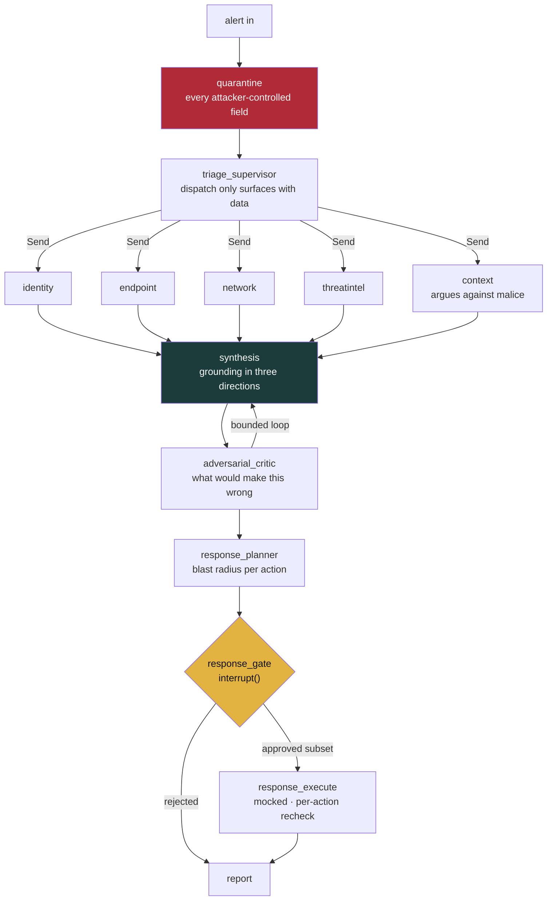
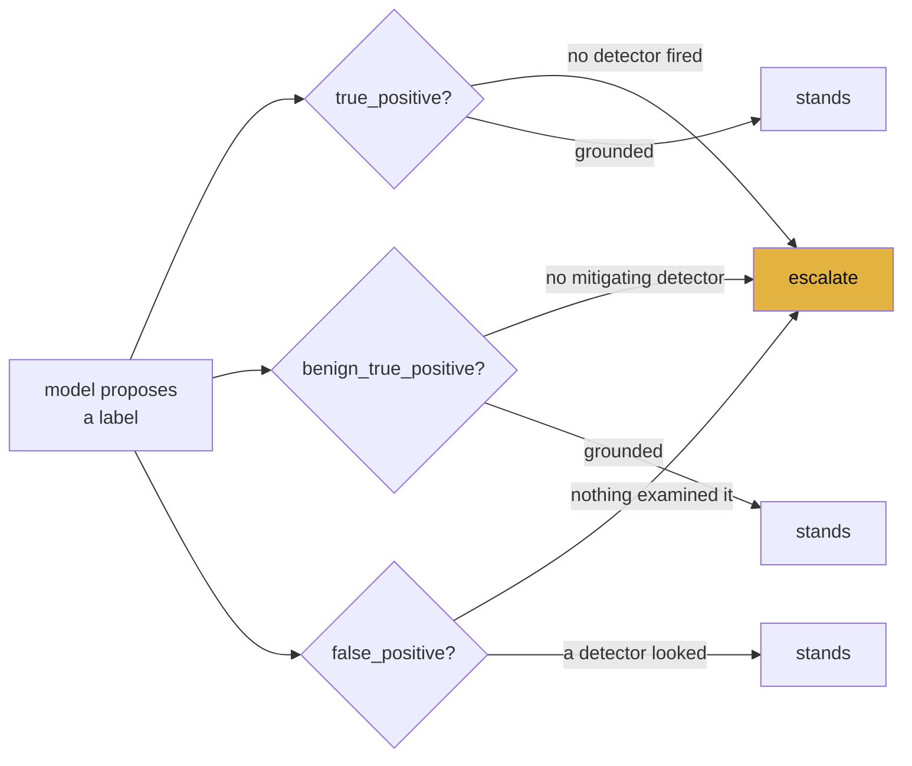
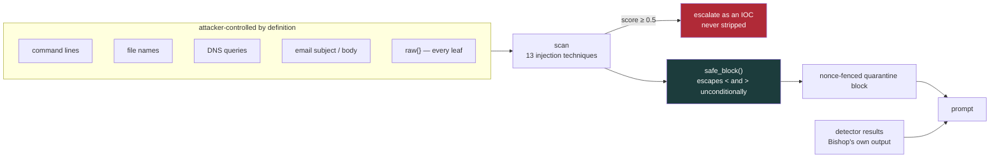

# Bishop

[](https://github.com/anubhavlal07/bishop/actions/workflows/ci.yml)


An **autonomous SOC analyst** built on **LangGraph** — and a study in what it takes to let a
language model near a security decision without letting it *make* one. Give Bishop an alert; it
quarantines every attacker-controlled field, dispatches a team of specialist investigators in
parallel, fuses their findings into a **MITRE ATT&CK-mapped verdict**, argues against itself,
proposes containment, and **stops dead at a human gate** before anything irreversible happens.
Every step is written to an append-only, hash-chained audit log.

<p align="center">
  
</p>

<p align="center"><em>Bishop will not contain a host on its own. It proposes, states the blast
radius of each action, and waits.</em></p>

It is built around four claims that are each **individually checkable**:

1. **The LLM reasons; unit-tested Python decides.** Every signal behind a verdict comes from a
   pure, deterministic detector. A model that invents a finding has it dropped and the refusal
   audited.
2. **The agent is an attack surface.** Alert fields are written by attackers. Bishop treats
   them as hostile input, and a payload that tries to steer it is escalated as an **IOC**, not
   stripped.
3. **Abstention is a feature.** Below its confidence threshold — or with nothing it can
   actually measure — Bishop hands the alert to a human and says why.
4. **No autonomous containment, ever.** Every action goes through `interrupt()` and a mocked
   executor. There is no code path that isolates a host without a recorded human decision.

**Live:** [bishop.anubhavlal.dev](https://bishop.anubhavlal.dev) · API at
[api.bishop.anubhavlal.dev](https://api.bishop.anubhavlal.dev/health)

The console is a **static export on Netlify** — every page is a client
component that talks to the API directly, so there is no server rendering to do
and the build is 1.1 MB of files. The API is a **Docker container on Render**,
with **Postgres in a Supabase schema**.

Both custom domains are served by small **Cloudflare Workers** that rewrite the
Host header, because Netlify and Render each only answer for hostnames
registered against them. The API proxy passes the SSE body through as a stream
rather than awaiting it — buffer that and the live topology view shows nothing
for twenty seconds and then everything at once.

> **Bring your own key.** The deployment stores no model credential. Pick Anthropic, OpenAI,
> Gemini or Azure OpenAI in the console, paste your key, and it stays in your browser. Or pick
> the **deterministic model** and run the whole thing with no key at all — the detectors, the
> ATT&CK validation, the injection scanner, the correlation and the audit chain are the same
> code either way.

---

## Capabilities

- **Parallel investigation graph** — the `StateGraph` is the single source of truth:
  `ingest → triage_supervisor →` `Send` fan-out to `identity / endpoint / network / threatintel
  / context` investigators `→ synthesis → adversarial_critic → response_planner → response_gate
  (HITL) → response_execute → report`. The supervisor dispatches only surfaces that have data.
- **22 deterministic detectors** — impossible travel, MFA fatigue, password spray, credential
  dumping, Kerberoasting, cloud token replay, LOLBin abuse, encoded commands, masquerading,
  persistence, recovery destruction, beaconing, DNS tunnelling, outbound volume, data staging,
  IOC reputation, and two *mitigating* detectors that can argue **against** malice. No model, no
  network, no clock read, no randomness — enforced by AST checks and double-run tests.
- **Indirect prompt-injection defence** — 13 techniques scored across a
  **132-payload red-team corpus**, currently **127 caught with 0 false positives** on 38 benign
  samples. Defence sits at the *render boundary*, because provenance cannot survive `str()`.
- **Validated ATT&CK mapping** — a technique ID reaches a report only after it is confirmed in
  the committed STIX bundle (823 techniques, v17.1). A model-proposed ID that fails validation
  is rejected and re-prompted, never passed through with a caveat.
- **Bring your own alert** — Sysmon, Elastic Common Schema, or any JSON with recognisable field
  names. The normaliser reports what it read, what it ignored, and **which detectors have
  jurisdiction** over what survived.
- **Hash-chained audit** — every dispatch, finding, refusal, verdict and decision is a link.
  The chain head is stored beside the incident, so a **truncated tail is detectable** —
  verifying a chain against itself cannot see that its end was removed.
- **Multi-alert correlation** — connected components over shared host or account within an
  hour. Three low-severity alerts become one intrusion.
- **Honest evaluation** — a tuned development set *and* **held-out sets run once**, reported
  side by side. The first scored 33% and was spent closing what it found; the second scores
  95% on verdicts and **58% on technique recall**, which is the number that still stings.

---

## Architecture

```
Backend (Python 3.12, FastAPI, LangGraph, SSE)        Frontend (Next.js App Router, React Flow)
──────────────────────────────────────────────        ──────────────────────────────────────────
quarantine/   the security boundary                    app/
detectors/    pure functions · no LLM · no network       /            alert queue
attck/        STIX validation + coverage matrix          /triage      bring your own alert
graph/        the StateGraph                             /runs/[id]   live topology + evidence
  ingest ─▶ triage_supervisor ─Send▶ investigators       /coverage    ATT&CK matrix
  ─▶ synthesis ─▶ adversarial_critic                     /scorecard   metrics + caveats
  ─▶ response_planner ─▶ response_gate (HITL)          components/
  ─▶ response_execute ─▶ report                          Topology     React Flow graph
audit/        append-only hash chain                     ApprovalModal per-action approval
models/       mock · anthropic · openai · gemini · azure  ProviderSetup BYOK dialog
store/        incidents + chains (SQLite / Postgres)   lib/           typed client · SSE
```

**The graph** — what actually runs, and where it stops:



**Grounding — the rule that makes a verdict mean something.** A label is only allowed if
something deterministic backs it, in *all three* directions:



The third arm is the one a held-out set found: closing a ticket is a claim that *someone
looked*. When every detector returned "nothing to work with", Bishop was reading **nobody
checked** as **nothing to find**.

**Untrusted data flow** — where attacker text is allowed to go:



---

## Tech stack

| Layer | Choice |
|---|---|
| Language | Python 3.12, `uv` for deps, `just` for tasks |
| Orchestration | LangGraph — supervisor, `Send` fan-out, `interrupt()`, checkpointing |
| API | FastAPI + SSE |
| Model | Deterministic mock (default) · Anthropic · OpenAI · Gemini · Azure OpenAI |
| Store | SQLite by default, Postgres in production — same schema either way |
| Console | Next.js App Router, React Flow, Tailwind v4 |
| Deploy | Docker · Render (API + Postgres) · Netlify (console) |

---

## Quick start

Requires Python 3.12 and [`uv`](https://docs.astral.sh/uv/).

```bash
uv sync --extra dev
just demo                  # triage an alert end to end, including the human gate
just eval                  # the scorecard, on the tuned development set
just eval-holdout          # the held-out set — the number that means something
just test                  # 1050 tests, 12 xfail (open injection gaps)
```

Then the console:

```bash
just api                   # FastAPI on :8000
just console               # Next.js on :3000
```

Everything above runs **offline with no key**. A model activates when you pick one in the
console, or with `BISHOP_MODEL_PROVIDER` and a key in `.env`.

### Triage an alert of your own

```bash
just triage my-alert.json        # or: cat alert.json | uv run bishop triage -
just formats                     # the shapes it recognises
```

It prints **what it read before what it concluded**, and that order is the point — a verdict is
only worth as much as the fields behind it:

<p align="center">
  
</p>

That detector list is computed by *running* them — a fact about your alert, not a claim about
the tool. When it comes back empty, `triage` says so and exits rather than producing a verdict
with nothing behind it.

---

## Using it

`just demo` triages a credential-dumping alert and stops at the gate shown at the top of this
page. Approve a subset and the rest come back `refused`, by name, in the execution log — a
console bug cannot isolate a host.

The gate leads with a sentence Bishop computes from the action list rather than one a model
wrote — *"This plan proposes: collect forensics, isolate host, revoke sessions, force password
reset and open ticket. 2 of 5 are irreversible."* — and prints the model's own strategy
underneath it, dimmed. The two can disagree, and when they do that is something the analyst sees
rather than something Bishop resolves for them. **17 of the 20 confirmed true positives propose
at least one irreversible action**, so the gate is doing real work in the demo rather than
decorating a plan that only opens tickets. Nothing behind it is real: every executor is
`MockExecutor`, which records intent and performs nothing.

The image above is generated by `scripts/render_terminal_svg.py` from that command's actual
output, so it cannot drift from what Bishop prints — which is worth something, because it did
drift once and the picture kept showing the gate as it had been before it was fixed.

The verdict it reaches:

<p align="center">
  
</p>

### Other things worth typing

```bash
just alerts                # the labelled corpus
just detectors             # every detector and what it measures
just incidents             # how the corpus correlates into incidents
just coverage              # regenerate docs/COVERAGE.md from the code
just keygen                # an API key for a deployment
just check-production      # would this config be allowed to serve?
```

---

## Evaluation

Three numbers. The first flatters, the last two do not, and one of them is spent.

| | Development set | Held-out #1 (spent) | Held-out #2 |
|---|---|---|---|
| Alerts | 33 | 15 | 20 |
| False-negative rate on true positives | **0%** | **50%** | **12.5%** |
| Verdict accuracy | 100% | **33%** | **95%** |
| False-positive rate | 0% | 20% | 0% |
| Escalation precision / recall | 100% / 100% | 50% / 17% | 100% / 100% |
| ATT&CK technique recall | 100% | 36% | **58%** |
| Invalid technique IDs emitted | 0 | 0 | 0 |
| Median time to triage | 0.03 s | 0.03 s | 0.04 s |

The development set was written first and the thresholds were tuned against it, so 100% there
measures **internal consistency** — detectors, mitigating rules and label definitions agreeing
with each other. It is a smoke test, not a benchmark.

A held-out set is written **after** the thresholds are frozen, run **once**, and reported
whatever it says. `just eval-holdout` deliberately has **no baseline and no regression gate**,
because a gate on a held-out set is precisely what turns it back into a training set. Both
results are committed under `eval/results/`, and both sets are in the repo.

**What the 33% was made of.** Ten of fifteen wrong, in three different ways: one real logic
defect (the third grounding arm), a set of coverage gaps where Bishop simply had no detector,
and two cases where my own label is arguable.

**Then it was spent, deliberately.** The logic defect and three of the coverage gaps —
Kerberoasting (T1558.003), recovery destruction (T1490) and cloud token replay (T1550.001) —
were real holes worth closing, so I closed them. Writing a detector against a held-out case
converts it into a development case, so those four can never be counted again and the set can no
longer produce a number. I left the label disagreements alone: adjusting a label until it agrees
with the output is exactly how a held-out set stops meaning anything. The fixtures are archived
in `fixtures/holdout-spent-2026-09-05/` rather than deleted, because a cited number whose inputs
are gone is a number nobody can check.

**The 95% is the second set: twenty new alerts, written once, run once.** Six describe
techniques Bishop has no detector for — AS-REP roasting, forged Kerberos tickets, WMI event
subscriptions, BITS transfers, container escape — and it escalated all six rather than guessing.
Five are false positives built to look exactly like the true positives, including the wide-and-
shallow scanner sweep that mirrors the password spray; none of them fired.

**Read that number sceptically, and here is why I do.** Twenty cases means one alert is five
points. Six of them test abstention on an uncovered technique, which is Bishop's most
predictable behaviour and the easiest thing for me to write toward. Three of the five false
positives lean on the trusted environment policy, which is a deterministic signal rather than a
judgement. And a set written by the person who knows the architecture is a weaker test than one
written by somebody who does not — that limitation does not go away by being disclosed.

The unflattering number in the same run is **technique recall at 58%**: Bishop reached the right
verdict far more often than it named the right ATT&CK techniques, and `docs/COVERAGE.md` shows
exactly where the gap is.

**The single miss is a defect in my fixture, not in Bishop, and it still counts against it.**
HO2-08 claims forty-eight high-entropy DNS labels; the generator I wrote emitted sixteen leading
zeros and a repeated twelve-character block, so the labels measure 3.1 bits per character where
a real tunnel is near 5. `dns_exfiltration` examined them and reported *"subdomain entropy and
length stayed within the range of ordinary hostnames"*, which is correct. Regenerating the case
and re-running would improve the score to 100% and destroy what the set is for, so the 95%
stands as scored — it understates rather than flatters, which is the right direction for an
error to point.

### Measured against a live model

The deterministic model is the default, so the live path was code-reviewed but
unrun for a long time. It has now been exercised against **Gemini 3.8 Flash**
over six alerts: **5 of 6 correct**, ~21 s and ~19k tokens per triage, 5 model
calls each. The one miss is a label disagreement rather than a failure — the
model called an admin PowerShell session `benign_true_positive` where the corpus
says `false_positive`, and it grounded that on a mitigating detector.

Running it live found four bugs the deterministic model could never surface, all
now fixed and covered by tests:

- **A valid key was rejected before any request.** The Gemini key pattern
  matched only the historical `AIza…` form, not the `AQ.` keys AI Studio now
  issues.
- **Thinking tokens ate the output budget.** `maxOutputTokens` covers thinking
  *and* output on Gemini 3.x, so a 16-token connectivity ping spent it all on
  thoughts and returned prose with a 200 status — telling users with a working
  key that it had been rejected.
- **A nullable field broke every synthesis call.** JSON Schema writes an optional
  string as `{"type": ["string", "null"]}`; Gemini's proto validator rejects a
  list-typed field outright.
- **The critic escalated everything.** It asked to escalate while writing "the
  verdict easily survives adversarial critique" and leaving confidence at 0.98.
  A competent critic can always name *some* alternative, so honouring an
  unsupported flag escalates every true positive — and a tool that escalates
  everything has perfect recall and is useless. The flag is now honoured only
  when the critic's own confidence adjustment supports it, and the refusal is
  written to the audit chain.

A fifth, smaller one: `action_type` was a free string, so the model proposed
`terminate_process` for what Bishop calls `kill_process`. The executor correctly
refused it, which left a containment plan quietly missing the actions the model
intended. The schema now enumerates the twelve real actions — two of which, `kill_process`
and `quarantine_file`, the executor refuses as policy, because a process name and a file
path both come out of the alert payload and checking one against the incident would be
checking a string the attacker wrote against itself.

A sixth came out of the deployed API rather than a live model, and it is the one
I would have shipped. Bishop triaged a token replay as a true positive at 0.85
and handed the approval gate a plan whose strategy read *contain the account and
the host together* — above a single action: open a ticket. The sentence was a
constant and nothing compared it to the list underneath it. An analyst who reads
the strategy and approves has been told something untrue about what they just
approved.

**My first fix for it was worse than the bug, and that is the more useful
story.** I made the planner look for containment words in the strategy and
replace the sentence when the actions did not support them. The audit pass took
it apart. Replacing means *deleting*: a strategy reading "do not isolate the file
server", or "isolate this by hand, Bishop cannot name the target", disappears
from the one screen where a human decides. And the matching was a vocabulary —
`isolat` caught "an isolated incident", `contain` caught "container", `kill `
caught "the kill chain", and the nine characters `no action` appearing anywhere
switched the whole rule off. A defence that recognises hostile input fails to
input it does not recognise; the threat model already says so about
`safe_block()`, and I had just written the same mistake one layer up.

The plan now carries two sentences. `strategy` is the model's, shown verbatim and
never edited. `proposes` is Bishop's, computed from the action list — *"This plan
proposes: open ticket. No containment action is included."* — so it cannot
disagree with the buttons, in any wording, in any language. The console shows
both, and a disagreement between them is now something the analyst sees rather
than something Bishop resolves on their behalf. The regression asserts it across
the whole corpus, so a new detector wired to no containment branch fails the
suite rather than shipping a plan that promises what it does not do.

Each is the same shape of defect: a model asserting something its own
measurements do not support — the failure the grounding rules exist for.

Both corpora are synthetic. Real SOC data is either licence-encumbered or full of somebody's
real hostnames, and a golden set has to be labelled. That buys honest labels and costs any
claim about real-world noise.

---

## Red-teaming the prompt surface

`tests/injection/` is a corpus of **132 payloads and 38 benign samples** written to defeat
Bishop's own defences. It found six ways in, and every one worked the same way: **not by
attacking the fence, but by going around it.**

`assert_no_untrusted()` was an instance check on a marker type — and every Python string
operation returns a plain `str`, so the marker did not survive `str(x)`, `x.lower()`, or an
f-string. Four live paths laundered attacker text into the block the system prompt describes as
*Bishop's own output*. A nineteen-character suffix on a real credential-dumping command line
flipped the verdict to `false_positive` and dropped all five containment actions.

The worst one was subtler: Bishop **detected** the injection, raised it as an IOC, wrote it to
the audit chain — and still returned `false_positive`, because a second field forged an empty
`<injection-findings>` block. **Detection and escalation are not the same thing as defence.**

The fix moved the boundary. Provenance cannot be tracked through `str()` in Python; refusing to
*emit* a delimiter can be. `safe_block()` escapes `<` and `>` unconditionally.

Current score: **127/132 caught, 38/38 benign clean**. The 5 that evade are strict-xfail tests,
so the suite fails the moment one is fixed and the ledger cannot go stale.

**What the last five are, and why they stay.** Three (`VRD-07/08/10`) claim
authorisation — a change window, an engagement flag, an allowlisted path. The
benign corpus contains almost the same sentences for entirely real reasons:
`BEN-22` records the very change number `VRD-07` invents. There is no lexical
difference between *claiming* authorisation and *recording* it, so any weight
that catches one flags the other. They sit at 0.45 deliberately and are defended
by **symmetric grounding** instead: clearing an alert as authorised requires a
mitigating detector reading environment policy, so prose cannot do it however
convincing it reads. `tests/injection/test_escalation_is_ioc.py` proves it on a
real credential-dumping alert.

The other two were never scanner problems and are fixed where they actually
live. `TOL-07`'s entire payload is the hostname `DC-01` — nothing to detect —
and it is stopped at the executor, which refuses to act on an entity the alerts
never named. `SPT-01` is half a payload, innocent alone, caught by scanning the
assembled quarantine block as well as each field.

---

## Deployment

Full guide in [`docs/DEPLOYMENT.md`](docs/DEPLOYMENT.md).

Bishop's defaults are laptop defaults. `BISHOP_ENVIRONMENT=production` turns them into
**startup checks** — it refuses to serve rather than warning, because a warning in a log nobody
reads is not a control:

| Setting | Required in production | Why |
|---|---|---|
| `BISHOP_API_KEYS` | ≥1 key, ≥32 chars | the API serves hostnames, accounts, and Bishop's view of which are compromised |
| `BISHOP_CORS_ORIGINS` | a named origin, never `*` | a wildcard lets any page read incident data from a browser holding a key |
| `BISHOP_RATE_LIMIT_PER_MINUTE` | above zero | every run costs tokens; an unlimited API is an unlimited bill |
| `DATABASE_URL` | Postgres, never SQLite | an audit chain that does not survive a restart is not an audit chain |

```bash
uv run bishop keygen              # Bishop will not invent a key for you
docker build -t bishop .          # non-root, no toolchain, frozen lockfile
uv run bishop config              # would this configuration be allowed to serve?
```

### The public demo is a declared mode, not a missing setting

The deployment above runs with `BISHOP_PUBLIC_DEMO=true`, and that flag is an
explicit choice with its own constraints rather than an absence of one. With it
on, Bishop **refuses** a rate limit looser than 60/min, **refuses** to also
demand an API key (a key baked into a public console's JavaScript protects
nothing), and **never writes an alert a visitor supplied to the shared store**.

That last one is the reason the mode exists. The store is shared and
`/incidents` lists it, so persisting a submitted alert on an open deployment
would publish one stranger's alert to every other visitor — and somebody
pasting a real alert from their own SIEM into a demo box has not agreed to
that. Corpus runs are still stored: those are synthetic and already in this
repository.

Demo mode also drops the Postgres requirement, for a stated reason rather than
convenience: the requirement exists because an audit chain that does not
survive a restart is not an audit chain, and in demo mode there is no such
chain — submitted alerts are never written, and corpus runs can simply be run
again.

---

## What this doesn't do

The honest list. If any of these matters to you, it needs building before Bishop is the right
tool for the job.

- **No per-user accounts or roles.** Every valid API key has identical authority, including
  approving containment. The chain records `decided_by` as whatever the client sent — it
  *attributes* a decision without *authenticating* who made it.
- **Bishop covers 36 ATT&CK techniques of 823.** Outside those it escalates rather than
  guessing. That is correct behaviour and still means a human does the work.
- **It triages what the SIEM gives it.** It inherits every gap in the detection layer above it
  and adds no coverage of its own.
- **The injection scanner is pattern- and heuristic-based.** Thirteen techniques is not all
  techniques; a regression corpus demonstrates the classes I thought of, which is not a proof.
- **Semantic steering** — a payload supplying plausible benign context with no imperative to
  detect — is the hardest class and only partially mitigated.
- **Rate limiting is per-instance and in memory.** Two instances means double the effective
  limit. Put a real limiter at the edge.
- **No SIEM connector.** Alerts arrive by API call, file, or paste.
- **No live containment integrations.** Every executor is a mock, on purpose.
- **A poisoned threat-intel feed degrades verdicts** without tripping the scanner.
- **The mitigating detectors read `fixtures/environment/policy.json`.** Anyone who can write to
  that file can exonerate themselves.

---

## Documentation

| | |
|---|---|
| [`docs/ARCHITECTURE.md`](docs/ARCHITECTURE.md) | graph topology, state shape, storage, the API surface |
| [`docs/THREAT-MODEL.md`](docs/THREAT-MODEL.md) | including "the agent is an attack surface", and what is *not* defended |
| [`docs/DETECTORS.md`](docs/DETECTORS.md) | every detector: the signal, the maths, where the thresholds came from |
| [`docs/COVERAGE.md`](docs/COVERAGE.md) | technique → detector → fixture matrix, generated from the code |
| [`docs/DEPLOYMENT.md`](docs/DEPLOYMENT.md) | production checks, Docker, Render, and the remaining gaps |
